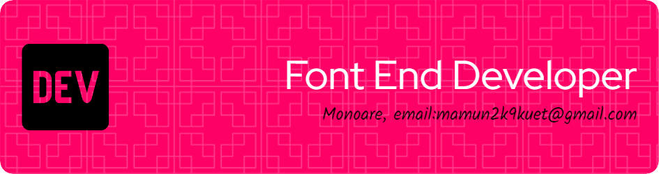

<h2 align="left">✍🏻 About Me</h2>

Hello, I'm <strong>Monoare Hossain</strong>, a passionate MERN Stack Developer with a keen eye for creating dynamic and user-centric web applications. Currently on a journey to become a <strong></strong>full-stack web developer, I bring enthusiasm and dedication to every project. My expertise lies in <strong>MongoDB</strong>, <strong>Express.js</strong>, <strong>React.js</strong>, and <strong>Node.js</strong>, and I am eager to expand my skills across the entire web development spectrum. Let's build something amazing together!

<h2 align="left">📈 GitHub Stats:</h2>

 

<h2 align="left">📁 My Projects:</h2>

<h4>Project-1: Vigor Vista</h4>

The project, tentatively named "Vigor Vista," is a web application designed to cater to fitness enthusiasts, providing a platform for various fitness-related activities, community engagement, and personalized user experiences.

**Features:**
_Role-Based Dashboard Navigation:_ Different dashboard views for admin, trainer, and member roles.

_User Authentication and Registration:_ Sign up, log in, and social login options for users.

_Content Management for Admin:_ Manage subscribers, trainers, balance, and handle trainer applications.

_Trainer-Specific Functionality:_ Manage slots, members, add new forums, and create new classes.

_Member-Specific Features:_ View activity logs, adjust profile settings, and access recommended classes.

**Live Link:** https://vigor-vista.web.app

---

<h4>Project-2: FreelanceHub</h4>

FreelanceHub is a dynamic platform connecting freelancers and employers. Users can effortlessly post and apply for jobs, benefit from secure authentication, and manage their activities through a user-friendly dashboard. Categorized job listings and a transparent booking system streamline the freelancing process, creating a seamless and efficient experience for both freelancers and employers.

**Features:**
_Quick Job Interaction:_ Post and apply for jobs effortlessly, fostering efficient connections between freelancers and employers.

_Secure Authentication:_ Robust user authentication with JWT tokens ensures a safe and trustworthy freelancing experience.

_User-Friendly Dashboard:_ Manage posted jobs, track applications, and review bidding history through a convenient and personalized dashboard.

_Categorized Job Listings:_ Jobs are categorized for easy filtering, simplifying the job search process for freelancers.

_Transparent Booking System:_ Freelancers can book jobs, and employers can manage and update job details, ensuring transparent communication.

**Live Link:** https://freelancehub-45daa.web.app

---

<h4>Project-3: Best Shop</h4>

Best Shop is a Fashion E-commerce platform featuring secure user authentication, a detailed product catalog, dark mode toggling, a convenient shopping cart, and responsive design. With brand collections, dynamic data fetching, and user-friendly alerts, it serves as a versatile foundation for fashion enthusiasts and developers. The project's potential for future enhancements positions it as a valuable tool within the fashion industry.

**Features:**

_User Authentication_ Enables secure registration and login for personalized experiences.

_Product Catalog:_ Displays products with essential details for easy browsing.

_Dark Mode Toggle:_ Offers a switch between light and dark themes for user preference.

_Shopping Cart:_ Allows users to manage selected items and costs conveniently.

_Responsive Design:_ Ensures a consistent, user-friendly experience across devices.

**Live Link:** https://bestshop-eae65.web.app

<h2 align="left">👨‍💻 Languages and Tools:</h2>

 - Frontend

  

 - Backend

  

 - Tools

  

